<h1> Ringo</h1>

---
## What is Ringo?
**Ringo** is an _event sharing & ticketing_ platform that allows organisations to create and share their events.  

It is user-experience focused and aims to provide a seamless experience for both the event organisers and the attendees.
Users can search for events, view event details, save events, purchase tickets and more.

The application consists of a **web app** and a [**mobile app**](https://github.com/andriikuiava/RingoFlutter). The web app is used by the event organisers to create and manage their events. 
The mobile app is used by the participants to view and purchase tickets for the events. 

The platform also provides a [**dedicated app**](https://github.com/andriikuiava/ringoqr) for scanning and validating tickets.

Some of the features of the application are:
- **Ability to build the app for both Android and iOS**
- Sign-in using Google / Apple
- Event search by distance to the user's location
- Support for multiple currencies (with automatic conversion when searching)
- Support for multiple ticket types (early bird, regular, etc.)
- Support for registration forms for events
- Users are able to review and rate organisers
- Ability to find events on the map
- Saving events, sharing them to social media including Instagram and Facebook stories as a sticker

---
## Technical aspects

> **_NOTE:_**  As we worked on Ringo as a team with my friends, this repository only contains my contributions to the project (Frontend for participants' app and [mobile scanner app](https://github.com/andriikuiava/ringoqr)).

Apps are written in Dart using the Flutter framework.
  
I used different packages for different purposes, some of them are:
- [**http**](https://pub.dev/packages/http) for making HTTP requests
- [**google_maps_flutter**](https://pub.dev/packages/google_maps_flutter) for displaying maps and selecting locations in the search
- [**flutter_stripe**](https://pub.dev/packages/flutter_stripe) for processing payments
- [**url_launcher**](https://pub.dev/packages/url_launcher) for opening links in the browser
- [**google_sign_in**](https://pub.dev/packages/google_sign_in) for handling Google sign-in and authentication

Some of the features are:
- Using secure storage for storing JWT tokens, refreshing them when expired
- Storing tickets in the local storage so that they can be accessed offline
- Both dark and light mode support
- Saving events to the device's calendar

---
## Tech stack

### Backend
<table>
    <tr>
        <th>
            
            
                Java
            
        </th>
        <th>
            
            
                Spring Boot
            
    </tr>
    <tr>
        <th>
            
            
                PostgreSQL
            
        </th>
        <th>
            
            
                Amazon S3
            
        </th>
    </tr>
</table>

### Web apps
<table>
    <tr>
        <th>
            
            
                JavaScript
            
        </th>
        <th>
            
            
                Vue.js
            
        </th>
    </tr>
</table>

### Mobile app
<table>
    <tr>
        <th>
            
            
                Flutter
            
        </th>
        <th>
            
            
                Dart
            
        </th>
    </tr>
</table>

---
## Screenshots

### Mobile app
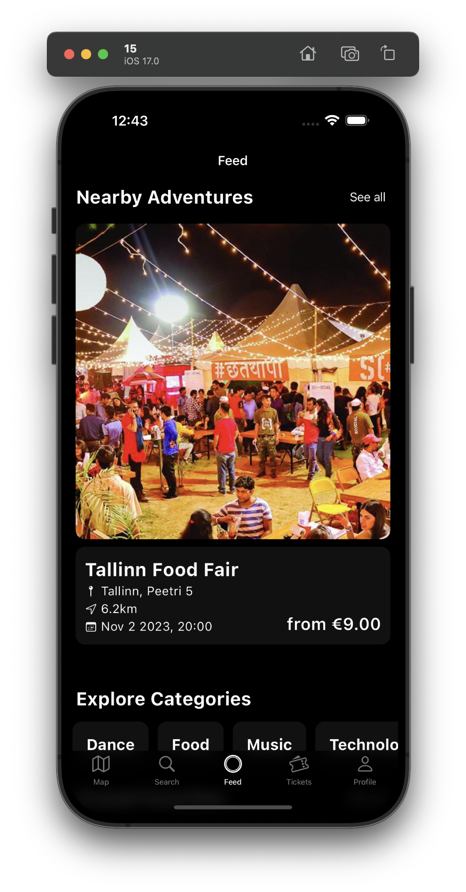
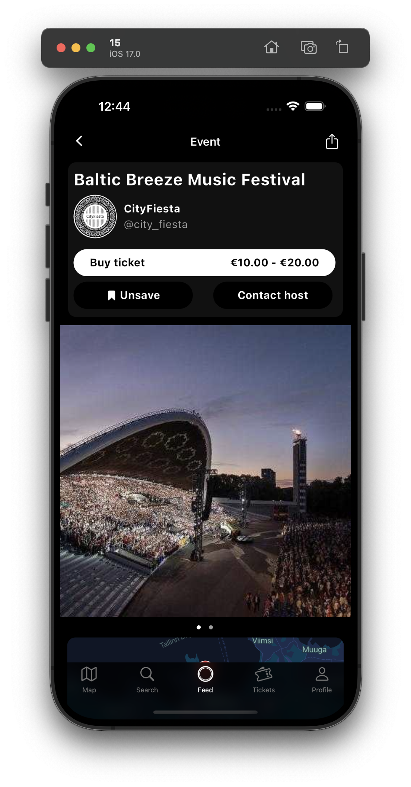
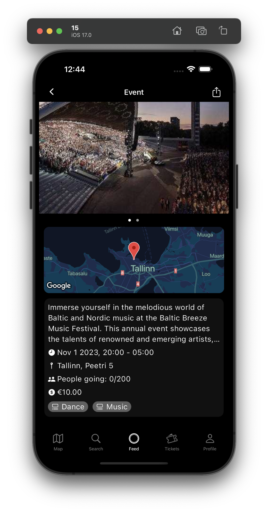
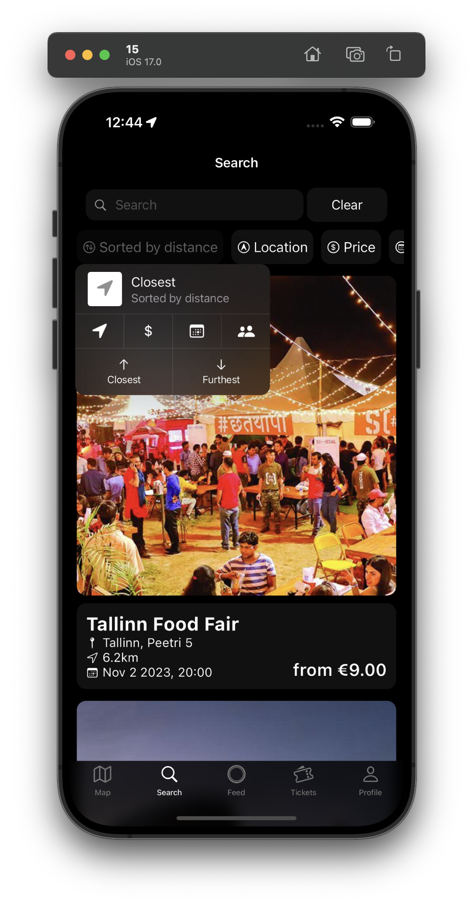
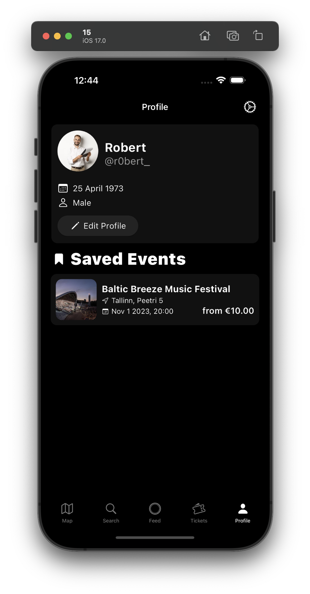
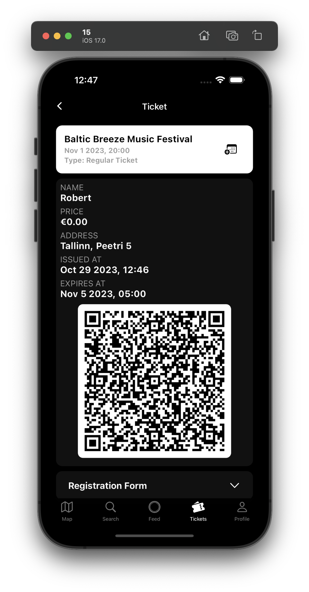
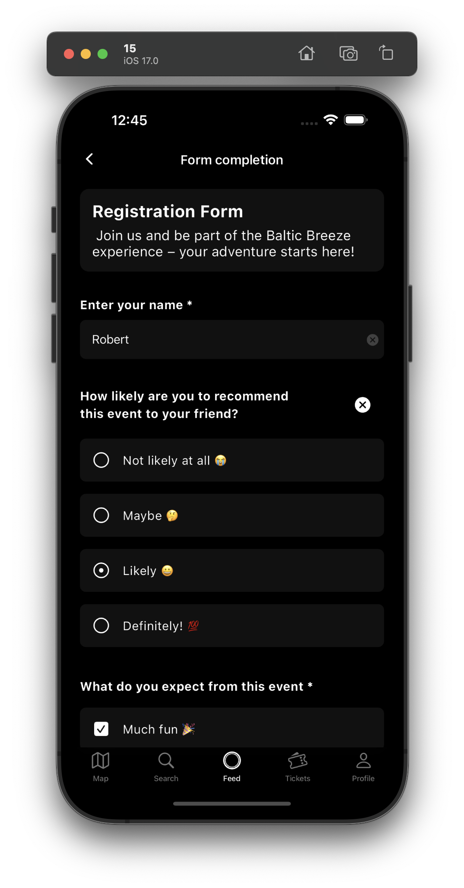
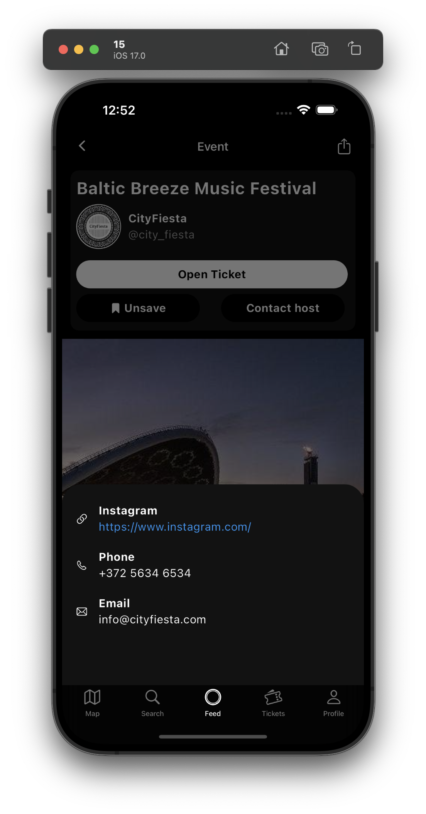
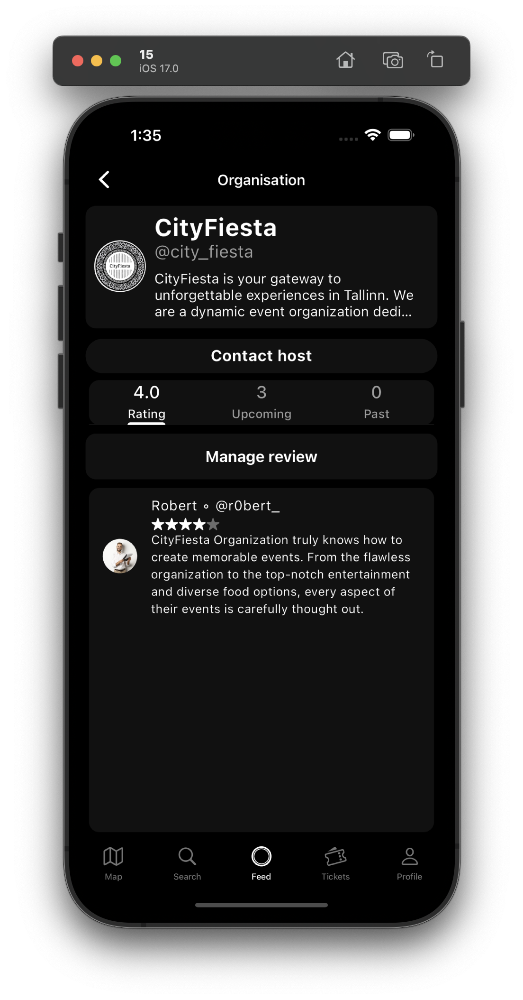

### Ticket scanner app
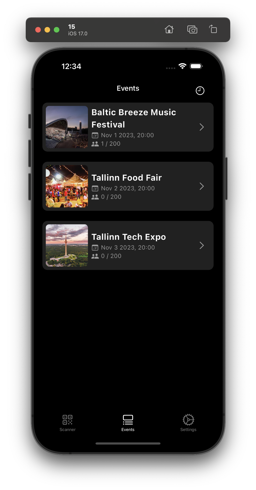
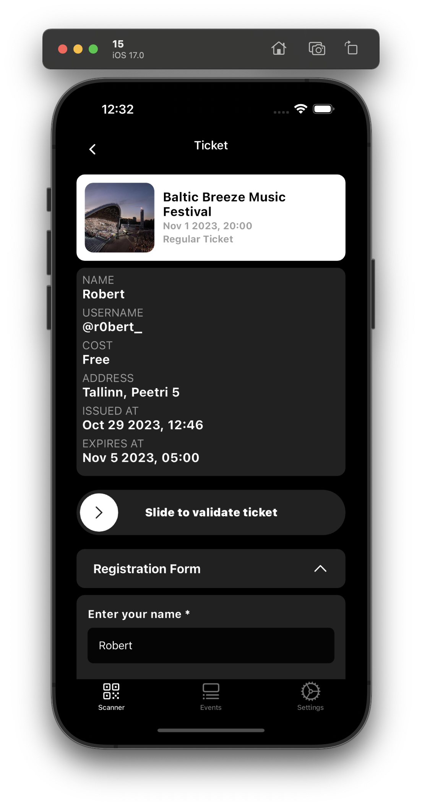
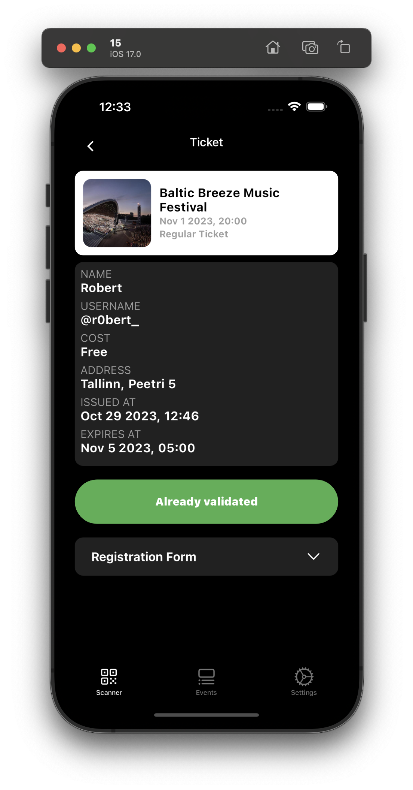

### Web app
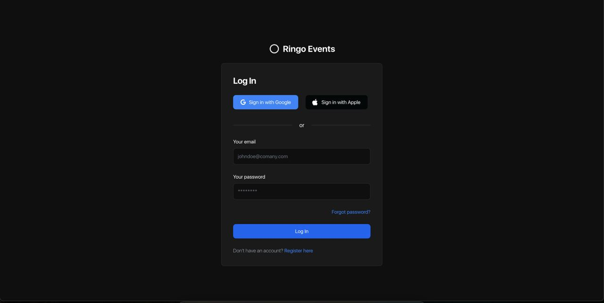 
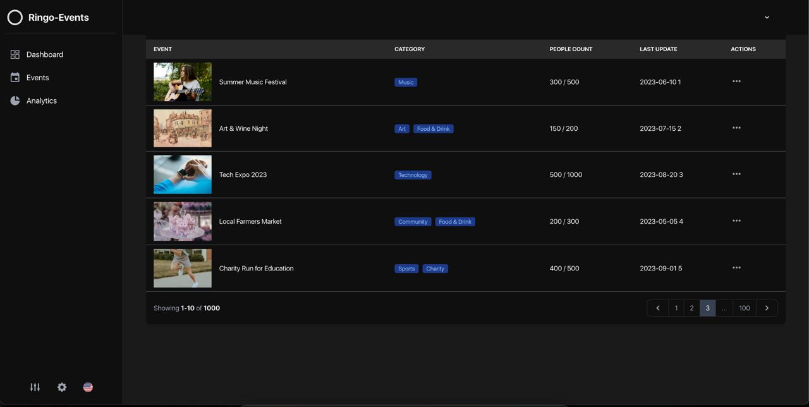 
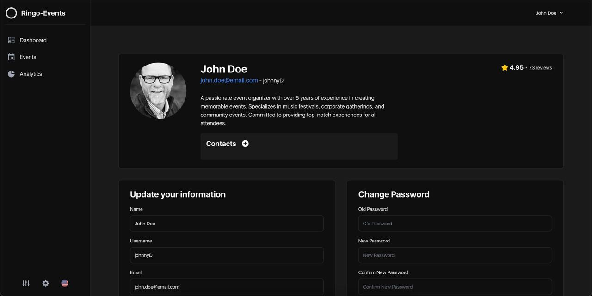 

